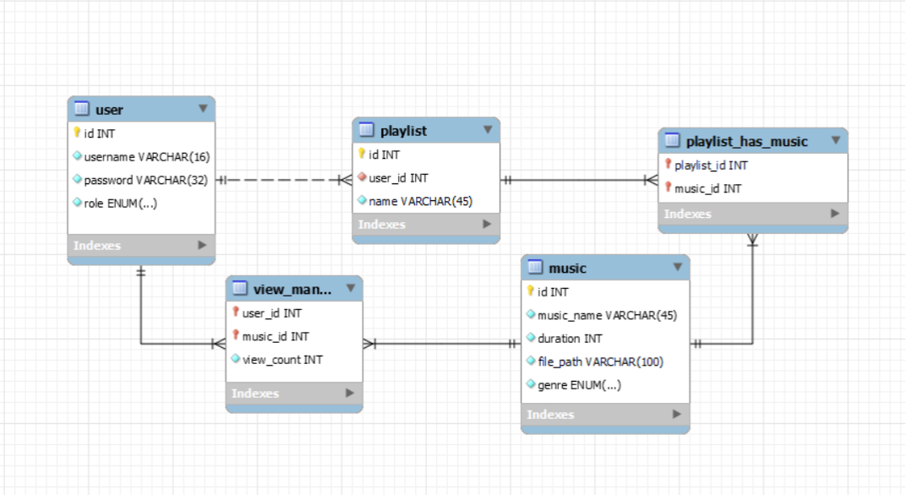
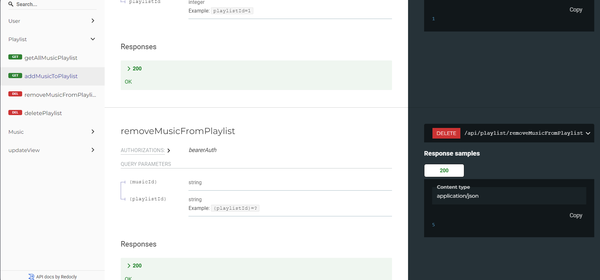

## Database design

## Api design
[For more details](https://documenter.getpostman.com/view/33854129/2sA3JT4Jcm#8048b8c0-1673-4959-99ff-221af2ea22a9) or [here](../back-end/apiDocument.html)

## Tech stack
1. Ngôn ngữ
   - Java
2. FrameWork sử dụng
   - Java Spring, Spring Boot
   - Hibernate, Spring Data JPA
   - Spring Security
3. Bảo mật
   - Sử dụng JWT  để authentication và authorize.
   - Xử lý  cors để cấu hình api.